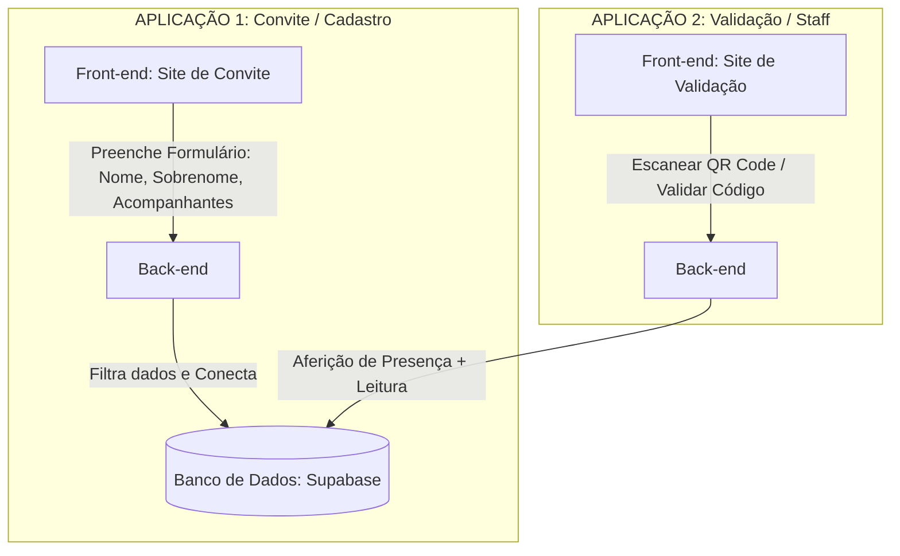

# Projeto Cassab Solidário

## Escopo do Projeto
O **Cassab Solidário** é um evento beneficente que ocorre anualmente, por volta do mês de setembro.

O objetivo deste projeto é desenvolver uma **plataforma de convites** para facilitar a aferição da presença dos participantes. A meta principal é evitar engarrafamentos nas filas de entrada e garantir agilidade nos processos de recepção.

## Funcionamento da Solução
A solução consiste em uma aplicação web conectada a um banco de dados relacional, dividida em dois momentos distintos:

1.  **Plataforma de Cadastro (Convite):**
    * Funciona como um "convite digital".
    * O convidado acessa um formulário para preencher seus dados (nome, sobrenome, etc.).
    * Permite adicionar acompanhantes.
    * Ao finalizar, gera um **Código** e um **QR Code** único associado ao usuário na base de dados.

2.  **Plataforma de Aferição (Presença):**
    * Utilizada no dia do evento para realizar o *check-in*.
    * Lê o QR Code ou aceita o código do convite.
    * Consulta a base de dados e registra a presença do convidado instantaneamente.

---

## Arquitetura e Fluxo da Aplicação

Abaixo, a representação visual da estrutura de cadastro e validação descrita no projeto:

## Detalhamento das Aplicações
### Aplicação 1 (Pré-evento)

    Interface: Exibição do formulário e preenchimento dos dados do usuário (P1).

    Back-end: Responsável por receber os dados, filtrar e persistir na base de dados.

### Aplicação 2 (Dia do evento)

    Interface: Exibição das ferramentas de validação (P2) e seleção da ferramenta (Scanner/Input).

    Funcionalidades:

        Função de escanear QR Code.

        Função de validar convite via código manual.

    Back-end: Processa a leitura e atualiza o status de presença no banco.

## Stack Tecnológica (Ferramentas)

Abaixo estão as tecnologias definidas para o desenvolvimento do projeto:

| Camada	| Tecnologia |
| Front-end |	React (Vite) + TypeScript |
| Back-end	| Java + Spring Boot |
| Banco de Dados | PostgreSQL (Hospedado no Supabase) |
| Versionamento	| Git / GitHub |

